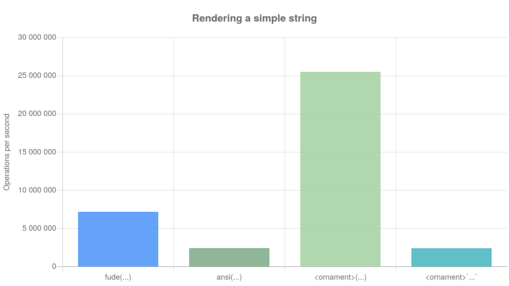
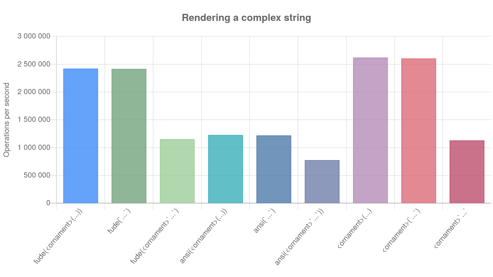
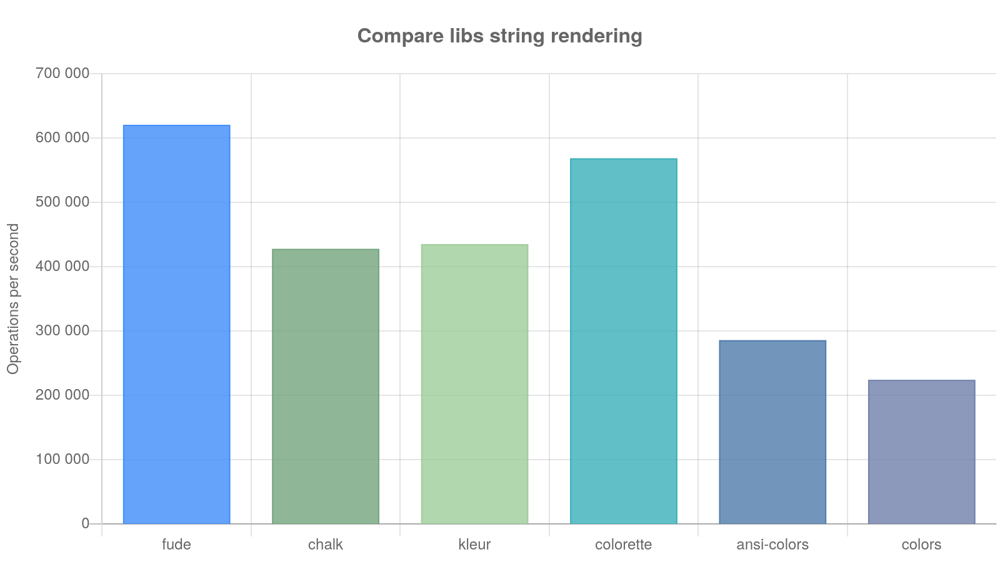
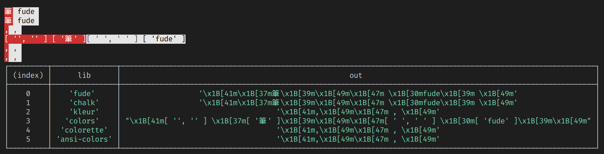

# Who's comparing? <!-- omit in toc -->

> Updated @ 30th Sep. 2021

Let's compare `fude`'s modus operandi first, then, let's see how it stacks against some other libraries.

- [Simple strings](#simple-strings)
- [Complex strings](#complex-strings)
- [Other libraries](#other-libraries)
- [String rendering](#string-rendering)
- [Library loading time](#library-loading-time)
- [Template literals handling](#template-literals-handling)

## Simple strings

How fast `fude` outputs the string `white on bright green` using various functions:

```js
fude(`white on bright green`, bgBrightGreen, white) // composing functions

ansi(`white on bright green`, bgBrightGreenCode, whiteCode) // ansi codes chains

bgBrightGreen(white(`white on bright green`)) // nested functions

bgBrightGreen`${white`white on bright green`}` // template literals
```

| name            | ops      | margin | percentSlower |
| --------------- | -------- | ------ | ------------- |
| fude(...)       | 7172309  | 0.3    | 71.87         |
| ansi(...)       | 2416062  | 0.55   | 90.53         |
| ornament\(...\) | 25500319 | 0.58   | 0             |
| ornament\`...\` | 2398830  | 0.3    | 90.59         |

**Nesting functions is way faster than anything else.**



## Complex strings

Testing string composition, e.g. a string with nested functions.

```js
fude(
  'white on bright green and ' +
    italic(bold('italic, bold and white on bright green background')),
  bgBrightGreen,
  white
)

fude(
  `white on bright green and ${italic(
    bold('italic, bold and white on bright green background')
  )}`,
  bgBrightGreen,
  white
)

fude(
  `white on bright green and ${italic`
        ${bold`italic, bold and white on bright green background`}
      `}`,
  bgBrightGreen,
  white
)

ansi(
  'white on bright green and ' +
    italic(bold('italic, bold and white on bright green background')),
  bgBrightGreenCode,
  whiteCode
)

ansi(
  `white on bright green and ${italic(
    bold('italic, bold and white on bright green background')
  )}`,
  bgBrightGreenCode,
  whiteCode
)

ansi(
  `white on bright green and ${italic`
        ${bold`italic, bold and white on bright green background`}
      `}`,
  bgBrightGreenCode,
  whiteCode
)

bgBrightGreen(
  white(
    'white on bright green and ' +
      italic(bold('italic, bold and white on bright green background'))
  )
)

bgBrightGreen(
  white(
    `white on bright green and ${italic(
      bold('italic, bold and white on bright green background')
    )}`
  )
)

bgBrightGreen`${white`white on bright green and ${italic`${bold`italic, bold and white on bright green background`}`}`}`
```

| name                   | ops     | margin | percentSlower |
| ---------------------- | ------- | ------ | ------------- |
| fude(ornament(...))    | 2421963 | 0.27   | 7.59          |
| fude(\`...\`)          | 2416448 | 0.49   | 7.8           |
| fude(ornament\`...\`)  | 1153682 | 0.15   | 55.98         |
| ansi(ornament(...))    | 1228010 | 0.19   | 53.14         |
| ansi(\`...\`)          | 1220167 | 0.37   | 53.44         |
| ansi(ornament\`...\`)) | 776548  | 0.2    | 70.37         |
| ornament(...)          | 2620817 | 0.6    | 0             |
| ornament(\`...\`)      | 2604863 | 0.75   | 0.61          |
| ornament\`...\`        | 1130286 | 0.29   | 56.87         |

**Again, not surprisingly, calling directly ornament's functions is faster.**



## Other libraries

- [`chalk`][chalk]
- [`kleur`][kleur]
- [`colorette`][colorette]
- [`ansi-colors`][ansi_colors]
- [`colors`][colors]

... what to compare?

- [Output rendering](#output) - how fast is `fude`?
- [Load times](#library-loading-time) - how fast `fude` loads (`require('fude')`)?
- [Template literals handling](#template-literals-handling) - how template literals are handled?

## String rendering

Using functions (which seems the only way supported by every library) we see that `fude` is fast.

| name        | ops    | margin | percentSlower |
| ----------- | ------ | ------ | ------------- |
| fude        | 620883 | 0.32   | 0             |
| chalk       | 427983 | 0.31   | 31.07         |
| kleur       | 435363 | 0.23   | 29.88         |
| colorette   | 568757 | 0.34   | 8.4           |
| ansi-colors | 286062 | 0.08   | 53.93         |
| colors      | 224229 | 0.27   | 63.89         |



## Library loading time

Let's load a library 1000 times and see what's the average loading time:

| library     | time    |
| ----------- | ------- |
| fude        | 0.846ms |
| chalk       | 2.768ms |
| kleur       | 0.443ms |
| colorette   | 0.746ms |
| ansi-colors | 1.395ms |
| colors      | 4.705ms |

Well, `kleur` is fast... but the library is smaller than the rest as well. `chalk` is choke-full of features, hence you pay for those. `colors`? unmaintenaid.

## Template literals handling

```js
bgRed`${white`筆`}` + bgWhite` ${black`fude`} `
```

Only `fude` and `chalk` are correctly handling template literals.



[chalk]: https://npmjs.com/package/chalk/v/4.1.2
[kleur]: https://npmjs.com/package/kleur/v/4.1.4
[colorette]: https://npmjs.com/package/colorette/v/2.0.12
[ansi_colors]: https://npmjs.com/package/ansi-colors/v/4.1.1
[colors]: https://npmjs.com/package/colors/v/1.4.0
