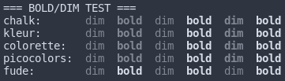
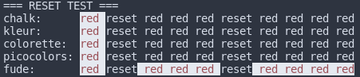

# 

> [nodejs][nodejs] library for terminal text style formatting.

[![npm][badge_npm]][fude]
![npm_dt][badge_npm_dt]
![npm_license][badge_npm_license]
![npm_types][badge_npm_types]
![bundle_tree][badge_bundle_tree]
![size][badge_size]
![coveralls][badge_coveralls]
![dependabot][badge_dependabot]
![Node.js CI][badge_nodejs_ci]
![CodeQL][badge_codeql]

## Features

- Fast loading, fast performing
- [`NO_COLOR`][no_color] friendly
- TypeScript support (types included)
- Automatic color detection
- Overrideable color support (e.g. stdout, stderr, etc.)
- No dependencies
- 8-bit, 24-bit color support
- Proper `bold`, `dim` support
- Proper `reset` support (optional with env variable or argument flag)
- Tagged template literals support (with helper library)

> ATTENTION: version 3.0.0 BREAKS backward compatibility with previous versions!

## Install

```sh
$ npm i fude
```

## Usage

Import `fude` the way you need it:

```ts
import { bgRed, white, bgWhite, black } from 'fude'
console.log(bgRed(white`筆`) + bgWhite(black` fude `))
```

```js
const { bgRed, white, bgWhite, black } = require('fude')
console.log(bgRed(white`筆`) + bgWhite(black` fude `))
```

```js
import fude from 'fude'
console.log(fude.bgRed(fude.white`筆`) + fude.bgWhite(fude.black` fude `))
```

```js
const fude = require('fude')
console.log(fude.bgRed(fude.white`筆`) + fude.bgWhite(fude.black` fude `))
```

## Styles

Character styles applicable to text.

| Modifiers       | Fg colors (normal) | Fg colors (bright) | Bg colors (normal) | Bg colors (bright) |
| --------------- | ------------------ | ------------------ | ------------------ | ------------------ |
| `reset`         | `black`            | `blackBright`      | `bgBlack`          | `bgBlackBright`    |
| `bold`          | `red`              | `redBright`        | `bgRed`            | `bgRedBright`      |
| `dim`           | `green`            | `greenBright`      | `bgGreen`          | `bgGreenBright`    |
| `italic`        | `yellow`           | `yellowBright`     | `bgYellow`         | `bgYellowBright`   |
| `underline`     | `blue`             | `blueBright`       | `bgBlue`           | `bgBlueBright`     |
| `inverse`       | `magenta`          | `magentaBright`    | `bgMagenta`        | `bgMagentaBright`  |
| `hidden`        | `cyan`             | `cyanBright`       | `bgCyan`           | `bgCyanBright`     |
| `strikethrough` | `white`            | `whiteBright`      | `bgWhite`          | `bgWhiteBright`    |
|                 |                    |                    |                    |                    |

> `blackBright` is also `gray` or `grey` \
> `bgBlackBright` is also `bgGray` or `bgGrey`

## 8-bit and 24-bit color support

Examples:

```js
import f from 'fude'

console.log(f.ansi256(9)('red'))

console.log(f.rgb(255, 99, 71)('tomato text'))

console.log(f.hexBg('#FFBF47')('mustard background'))
```

## Color support override

### Programmatically

It is possible to override the automatic detection of the color support level. This might be useful for when piping the output to a file, or splitting the `stderr` and `stdout` streams.

```js
import f from 'fude'

const noColors = f.Fude({ level: 0 }) // color support levels: 0 none, 1 basic, 2 ANSI 256, 3 Truecolor

console.log(f.red('red text!')) // in red

console.log(noColors.red('red text?')) // nope, text is plain

const errorStream = f.Fude({ level: 'stderr' }) // get the support level of `stderr` or `stdout`

console.error(errorStream.red('Error!')) // this will be red only if stderr supports colors
```

### Environment variables

`FORCE_COLOR` can be used to override the automatic detection of the color support level. (see [NodeJS TTY][nodetty])

Valid values are:

- `0`: Switch off color support
- `1`: Basic color support
- `2`: ANSI 256 color support
- `3`: Truecolor color support

**Any other value will be ignored (switch on auto color detection).**

```sh
# color support set to basic colors
FORCE_COLOR=1 node example.js
```

`NO_COLOR` (also `NODE_DISABLE_COLORS`) can be used to switch off the color support.

```sh
# color support set to none
NO_COLOR= node example.js
```

> `FORCE_COLOR` overrides both `NO_COLOR` and `NODE_DISABLE_COLORS`

### CLI Arguments `--color[=0|1|2|3]` and `--no-color`

```sh
# --color without a value will set color support to auto detection (the default)
$ node example.js --color
# color support set to none
$ node example.js --no-color
# color support set to truecolor
$ node example.js --color=3
```

## Proper `bold` and `dim` support

Given a string like this (with embedded `dim`s and `bold`s)

```js
import c from 'fude' // 'chalk', 'colorette', 'picocolors' or 'kleur'

const output =
  c.dim(' dim ' + c.bold(' bold ') + ' dim ') +
  c.bold(' bold ' + c.dim(' dim ') + ' bold ')
```

We get these results:



> `fude` handles `bold` and `dim` properly by default.

## Proper `reset` support

`fude` does not properly handle reset by default. This is the behaviour of every other CLI text styling library. The reason is that the check for reset is expensive, and it is not necessary for most cases.

To fix this, you can use the env variable `HANDLE_RESET` or the argument flag `--handle-reset`.

```sh
# handle reset
HANDLE_RESET= node example.js

# handle reset
node example.js --handle-reset
```

This is what I mean by properly handling `reset`:



## Tagged Template Literals

Tagged template literals are supported with a helper library such as [colorize-template][colorize-template].

```js
import fude from 'fude'
import { createColorize } from 'colorize-template'

const colorize = createColorize(fude)

console.log(colorize`{bgRed {white 筆}}{bgWhite ${fude.rgb(0, 0, 0)('fude ')}}`)
```

## What's in a name?

[**Fude**][ink_brush] (筆 - Japanese pronunciation: [[ɸɯ̟ᵝde̞][ipa]] foo-de -- **de** as in **de**ntist) is Japanese for a calligraphy brush. Since there isn't really a plural form in Japanese, in this case 'fude' can be interpreted as 'brushes'.

## Thanks & Credits

Thanks to the authors of and contributors to [`colorette`][colorette] and [`picocolors`][picocolors] for their work which I have borrowed heavily to improve performance in v3.0.

Also, thanks to [`chalk`][chalk] because it is always the slowest and everyone badmouths it, but it has a gazillion of installations and everyone envies it.

Benchmarks? Every CLI text styling library has its own benchmarks and it is always the fastest... go figure.

## Changelog

The changelog can be found on the [Releases page][releases].

## Contributing

PRs welcomed here.

## Authors and license

[Mirco Sanguineti][msanguineti] and [contributors][contributors].

MIT License, see the included [LICENCE](LICENCE) file.

[msanguineti]: https://github.com/msanguineti/
[repo]: https://github.com/msanguineti/fude
[contributors]: https://github.com/msanguineti/fude/graphs/contributors
[releases]: https://github.com/msanguineti/fude/releases
[nodejs]: https://nodejs.org
[badge_npm]: https://badgen.net/npm/v/fude
[badge_npm_dt]: https://badgen.net/npm/dt/fude
[badge_npm_license]: https://badgen.net/npm/license/fude
[badge_npm_types]: https://badgen.net/npm/types/fude
[badge_bundle_tree]: https://badgen.net/bundlephobia/tree-shaking/fude
[badge_size]: https://badgen.net/packagephobia/install/fude
[badge_coveralls]: https://badgen.net/coveralls/c/github/msanguineti/fude/main
[badge_dependabot]: https://badgen.net/github/dependabot/msanguineti/fude
[badge_nodejs_ci]: https://github.com/msanguineti/fude/workflows/Node.js%20CI/badge.svg
[badge_codeql]: https://github.com/msanguineti/fude/workflows/CodeQL/badge.svg
[ink_brush]: https://en.wikipedia.org/wiki/Ink_brush
[ipa]: https://en.wikipedia.org/wiki/Help:IPA/Japanese
[sgr_params]: (https://en.wikipedia.org/wiki/ANSI_escape_code#SGR_parameters)
[fude]: https://npmjs.com/package/fude
[nodetty]: https://nodejs.org/docs/latest-v14.x/api/tty.html#tty_writestream_getcolordepth_env
[colorette]: https://npmjs.com/package/colorette
[picocolors]: https://npmjs.com/package/picocolors
[chalk]: https://npmjs.com/package/chalk
[no_color]: https://no-color.org/
[colorize-template]: https://npmjs.com/package/colorize-template
