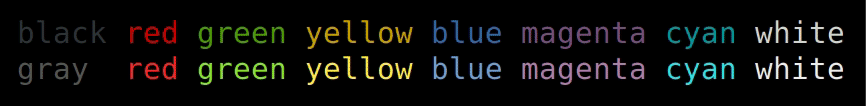
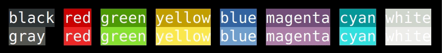

#  <!-- omit in toc -->

> [nodejs][nodejs] library for terminal text style formatting.

[](https://npmjs.com/fude)


- Fast loading, fast performing
- ANSI Codes complete
- 100% tree-shakeable by design
- Template literals friendly
- Font modifiers
- 

- Foreground colours (normal & bright)



- Background colours (normal & bright)



## Table of contents <!-- omit in toc -->

- [Install](#install)
- [Usage](#usage)
  - [TTY capabilities](#tty-capabilities)
  - [TypeScript](#typescript)
- [Status](#status)
  - [TODO](#todo)
- [What's in a name?](#whats-in-a-name)
- [Changelog](#changelog)
- [Contributing](#contributing)
- [Authors and license](#authors-and-license)

## Install

```sh
$ npm i fude
```

## Usage

```js
import { fude, white, black, bgRed, bgWhite } from 'fude'

console.log(fude('筆', bgRed, white) + fude(' fude ', bgWhite, black))

// alternatively...

console.log(bgRed(white`筆`) + bgWhite(black` fude `))

// ...template literals

console.log(bgRed`${white`筆`}` + bgWhite`${black` fude `}`)

// nesting (same result, slightly different intentions with the backgrounds)...

console.log(bgRed(white('筆') + bgWhite(` ${black('fude')} `)))

// template literals (also nested)...

console.log(bgRed`${white`筆`}${bgWhite` ${black`fude`} `}`)
```

### TTY capabilities

To check what your TTY is capable of, call this handy function:

```js
import { availableOrnamentCodes } from 'fude'

console.log(availableOrnamentCodes())
```

### TypeScript

TypeScript types are included.

## Status

This project has just started. I want to put it out there, but there are few things I want to add and few things I need to refactor a bit. Nonetheless, this library is very much usable as it is right now.

### TODO

- [ ] Better documentation
- [ ] Add a couple of cool features ✨
- [ ] Add some benchmark to show that this lib is the bestest :unicorn:
- [ ] Revise code comments
- [ ] ???
- [ ] Profit

## What's in a name?

[**Fude**](https://en.wikipedia.org/wiki/Ink_brush) (筆 - Japanese pronunciation: [[ɸɯ̟ᵝde̞](https://en.wikipedia.org/wiki/Help:IPA/Japanese)] foo-de -- **de** as in **de**ntist) is Japanese for a calligraphy brush. Since there isn't really a plural form in Japanese, in this case 'fude' can be interpreted as 'brushes'.

The idea is that you use a different brush for a different style of stroke (or colour). Here you have different font styles and foreground/background colours.

```js
fude('筆', bgRed, white)
```

This means, I want to use this set of brushes (`bgRed` and `white`) to compose the given text: `筆`.

## Changelog

The changelog can be found on the [Releases page][releases].

## Contributing

Everyone is welcome to contribute. Please take a moment to review the [contributing guidelines](Contributing.md).

## Authors and license

[Mirco Sanguineti](https://github.com/msanguineti/) and [contributors][contributors].

MIT License, see the included [LICENCE](LICENCE) file.

[nodejs]: https://nodejs.org
[home]: https://github.com/msanguineti/fude
[contributors]: https://github.com/msanguineti/fude/graphs/contributors
[releases]: https://github.com/msanguineti/fude/releases
[wiki]: https://en.wikipedia.org/wiki/Ink_brush
