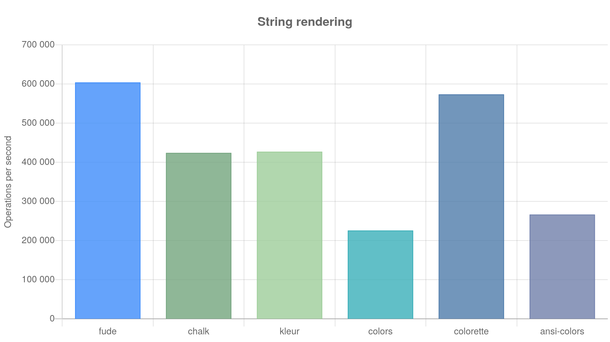

#  <!-- omit in toc -->

> [nodejs][nodejs] library for terminal text style formatting.

[](https://npmjs.com/fude)


## Features <!-- omit in toc -->

- Fast loading, fast performing
- ANSI Codes complete
- 100% tree-shakeable by design
- Template literals friendly
- Font modifiers


- Foreground colors (normal & bright)


- Background colors (normal & bright)


## Table of contents <!-- omit in toc -->

- [Install](#install)
- [Usage](#usage)
  - [TTY capabilities](#tty-capabilities)
- [API](#api)
  - [`fude(string, ...<ornament>)`](#fudestring-ornament)
  - [`fude.<ornament>(string|<ornament>())`](#fudeornamentstringornament)
  - [Tagged template literals](#tagged-template-literals)
- [Ornaments](#ornaments)
  - [Note on terminal capabilities](#note-on-terminal-capabilities)
- [ANSI Codes](#ansi-codes)
  - [`fude.ansi(string, ...number)`](#fudeansistring-number)
- [TypeScript](#typescript)
- [Who's comparing?](#whos-comparing)
  - [Output](#output)
  - [Library loading time](#library-loading-time)
  - [Template literals handling](#template-literals-handling)
- [What's in a name?](#whats-in-a-name)
- [Changelog](#changelog)
- [Contributing](#contributing)
- [Authors and license](#authors-and-license)

## Install

```sh
$ npm i fude
```

## Usage

```js
import { fude, white, black, bgRed, bgWhite } from 'fude'

console.log(fude('筆', bgRed, white) + fude(' fude ', bgWhite, black))

// alternatively...

console.log(bgRed(white`筆`) + bgWhite(black` fude `))

// ...template literals

console.log(bgRed`${white`筆`}` + bgWhite`${black` fude `}`)

// nesting (same result, slightly different intentions with the backgrounds)...

console.log(bgRed(white('筆') + bgWhite(` ${black('fude')} `)))

// template literals (also nested)...

console.log(bgRed`${white`筆`}${bgWhite` ${black`fude`} `}`)
```

### TTY capabilities

To check what your TTY is capable of, call this handy function:

```js
import { ttyCapability } from 'fude'

console.log(ttyCapability())
```

## API

### `fude(string, ...<ornament>)`

Example:

```js
let output = fude('red text on white background', red, bgWhite)
```

### `fude.<ornament>(string|<ornament>())`

Example:

```js
let output = bgWhite(red('red text on white background'))
```

### Tagged template literals

Example:

```js
let output1 = `${red`red text`} and ${bgWhite`${blue`blue text on white background`}`}`

let output2 =
  `${red`red text`}` +
  ' and ' +
  `${bgWhite(blue`blue text on white background`)}`

// output1 === output2
```

## Ornaments

Character ornaments (styles) applicable to text.

- Modifiers
- Foreground Colors
- Background Colors

| Modifiers         | Fg colors (normal) | Fg colors (bright) | Bg colors (normal) | Bg colors (bright) |
| ----------------- | ------------------ | ------------------ | ------------------ | ------------------ |
| `bold`            | `black`            | `gray`             | `bgBlack`          | `bgGray`           |
| `dim`             | `red`              | `brightRed`        | `bgRed`            | `bgBrightRed`      |
| `italic`          | `green`            | `brightGreen`      | `bgGreen`          | `bgBrightGreen`    |
| `underline`       | `yellow`           | `brightYellow`     | `bgYellow`         | `bgBrightYellow`   |
| `doublyUnderline` | `blue`             | `brightBlue`       | `bgBlue`           | `bgBrightBlue`     |
| `blinkSlow`       | `magenta`          | `brightMagenta`    | `bgMagenta`        | `bgBrightMagenta`  |
| `blinkFast`       | `cyan`             | `brightCyan`       | `bgCyan`           | `bgBrightCyan`     |
| `inverse`         | `white`            | `brightWhite`      | `bgWhite`          | `bgBrightWhite`    |
| `hide`            |                    |                    |                    |                    |
| `strikethrough`   |                    |                    |                    |                    |

### Note on terminal capabilities

1. Exact colors values are dependant on the terminal implementation.

2. Not all modifiers are available on every terminal.

(check your [terminal capabilities](#tty-capabilities))

## ANSI Codes

It is possible to call directly the [ANSI code](https://en.wikipedia.org/wiki/ANSI_escape_code#SGR_parameters) number:

### `fude.ansi(string, ...number)`

Example: `ansi('This text is black on green background', 42, 30)`

As a convenience, it is possible to use [ornaments](#ornaments) by appending `Code` to their name:

```js
fude.ansi('This text is black on green background', bgGreenCode, blackCode)
```

## TypeScript

TypeScript types are included.

## Who's comparing?

Let's compare `fude` with some other libraries:

- [`chalk`](https://npmjs.com/chalk)
- [`kleur`](https://npmjs.com/kleur)
- [`colorette`](https://npmjs.com/colorette)
- [`ansi-colors`](https://npmjs.com/ansi-colors)
- [`colors`](https://npmjs.com/colors)

... what to compare?

- [Output rendering](#output) - how fast is `fude`?
- [Load times](#library-loading-time) - how fast `fude` loads (`require('fude')`)?
- [Template literals handling](#template-literals-handling) - how template literals are handled?

### Output

`fude` is fast.

| name        | ops    | margin | percentSlower |
| ----------- | ------ | ------ | ------------- |
| fude        | 604509 | 0.24   | 0             |
| chalk       | 424405 | 0.26   | 29.79         |
| kleur       | 427387 | 0.68   | 29.3          |
| colors      | 226040 | 0.26   | 62.61         |
| colorette   | 573854 | 0.31   | 5.07          |
| ansi-colors | 266812 | 1.46   | 55.86         |



### Library loading time

Let's load a library 1000 times and see what's the average loading time:

| library     | average time |
| ----------- | ------------ |
| fude        | 0.563ms      |
| chalk       | 1.969ms      |
| kleur       | 0.328ms      |
| colors      | 4.554ms      |
| colorette   | 0.352ms      |
| ansi-colors | 0.970ms      |

Well, `colorette` and `kleur` are fast... but the libraries are smaller than the rest as well.

### Template literals handling

```js
bgRed`${white`筆`}` + bgWhite` ${black`fude`} `
```

Only `fude` and `chalk` are correctly handling template literals (as of November 2020)


## What's in a name?

[**Fude**](https://en.wikipedia.org/wiki/Ink_brush) (筆 - Japanese pronunciation: [[ɸɯ̟ᵝde̞](https://en.wikipedia.org/wiki/Help:IPA/Japanese)] foo-de -- **de** as in **de**ntist) is Japanese for a calligraphy brush. Since there isn't really a plural form in Japanese, in this case 'fude' can be interpreted as 'brushes'.

The idea is that you use a different brush for a different style of stroke (or color). Here you have different font styles and foreground/background colors.

```js
fude('筆', bgRed, white)
```

This means, I want to use this set of brushes (`bgRed` and `white`) to compose the given text: `筆`.

## Changelog

The changelog can be found on the [Releases page][releases].

## Contributing

Everyone is welcome to contribute. Please take a moment to review the [contributing guidelines](Contributing.md).

## Authors and license

[Mirco Sanguineti](https://github.com/msanguineti/) and [contributors][contributors].

MIT License, see the included [LICENCE](LICENCE) file.

[nodejs]: https://nodejs.org
[home]: https://github.com/msanguineti/fude
[contributors]: https://github.com/msanguineti/fude/graphs/contributors
[releases]: https://github.com/msanguineti/fude/releases
[wiki]: https://en.wikipedia.org/wiki/Ink_brush
