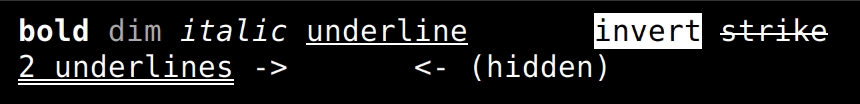
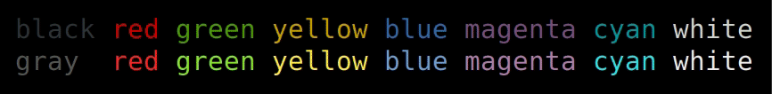
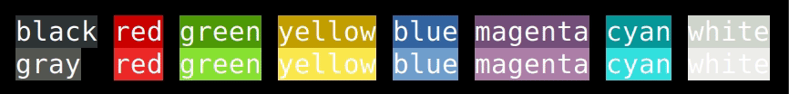
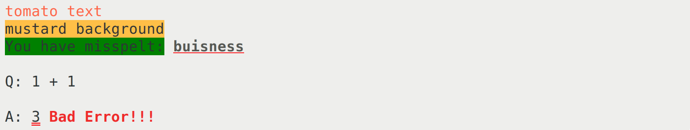

#  <!-- omit in toc -->

> [nodejs][nodejs] library for terminal text style formatting.

[![npm][badge_npm]][fude]
![npm_dt][badge_npm_dt]
![npm_license][badge_npm_license]
![npm_types][badge_npm_types]
![bundle_tree][badge_bundle_tree]
![size][badge_size]
![coveralls][badge_coveralls]
![dependabot][badge_dependabot]
![Node.js CI][badge_nodejs_ci]
![CodeQL][badge_codeql]

## Features <!-- omit in toc -->

- Fast loading, fast performing
- ANSI Codes complete
- 100% tree-shakeable by design
- Template literals friendly
- Font modifiers



- Foreground colors (normal & bright)



- Background colors (normal & bright)



## Table of contents <!-- omit in toc -->

- [Install](#install)
- [Usage](#usage)
  - [TTY capabilities](#tty-capabilities)
- [API](#api)
  - [`fude(string, ...<ornament>)`](#fudestring-ornament)
  - [`fude.<ornament>(string|<ornament>())`](#fudeornamentstringornament)
  - [Tagged template literals](#tagged-template-literals)
- [Ornaments](#ornaments)
  - [Note on terminal capabilities](#note-on-terminal-capabilities)
- [RGB & HEX](#rgb--hex)
  - [`fude.rgb(string|<ornament>, {r:number, g:number, b:number})`](#fudergbstringornament-rnumber-gnumber-bnumber)
  - [`fude.hex(string|<ornament>, hex:number)`](#fudehexstringornament-hexnumber)
  - [`fude.rgbBg(string|<ornament>, {r:number, g:number, b:number})`](#fudergbbgstringornament-rnumber-gnumber-bnumber)
  - [`fude.hexBg(string|<ornament>, hex:number)`](#fudehexbgstringornament-hexnumber)
  - [`fude.rgbUnderline(string|<ornament>, {r:number, g:number, b:number, double?:boolean})`](#fudergbunderlinestringornament-rnumber-gnumber-bnumber-doubleboolean)
  - [`fude.hexUnderline(string|<ornament>, hex:number, double?:boolean)`](#fudehexunderlinestringornament-hexnumber-doubleboolean)
- [ANSI SGR Parameters Codes](#ansi-sgr-parameters-codes)
  - [`fude.ansi(string|<ornament>, ...number)`](#fudeansistringornament-number)
- [TypeScript](#typescript)
- [What's in a name?](#whats-in-a-name)
- [Benchmarks](#benchmarks)
- [Changelog](#changelog)
- [Contributing](#contributing)
- [Authors and license](#authors-and-license)

## Install

```sh
$ npm i fude
```

## Usage

```js
import { fude, white, black, bgRed, bgWhite } from 'fude'

console.log(fude('筆', bgRed, white) + fude(' fude ', bgWhite, black))

// alternatively...

console.log(bgRed(white`筆`) + bgWhite(black` fude `))

// ...template literals

console.log(bgRed`${white`筆`}` + bgWhite`${black` fude `}`)

// nesting (same result, slightly different intentions with the backgrounds)...

console.log(bgRed(white('筆') + bgWhite(` ${black('fude')} `)))

// template literals (also nested)...

console.log(bgRed`${white`筆`}${bgWhite` ${black`fude`} `}`)
```

### TTY capabilities

To check what your TTY is capable of, call this handy function:

```js
import { ttyCapability } from 'fude'

console.log(ttyCapability())
```

## API

### `fude(string, ...<ornament>)`

Example:

```js
import { fude, bgWhite, red } from 'fude'

let output = fude('red text on white background', red, bgWhite)
```

### `fude.<ornament>(string|<ornament>())`

Example:

```js
import { bgWhite, red } from 'fude'

let output = bgWhite(red('red text on white background'))
```

### Tagged template literals

Example:

```js
import { bgWhite, red, blue } from 'fude'

let output1 = `${red`red text`} and ${bgWhite`${blue`blue text on white background`}`}`

let output2 =
  `${red`red text`}` +
  ' and ' +
  `${bgWhite(blue`blue text on white background`)}`

// output1 === output2
```

## Ornaments

Character ornaments (styles) applicable to text.

- Modifiers
- Foreground Colors
- Background Colors

| Modifiers         | Fg colors (normal) | Fg colors (bright) | Bg colors (normal) | Bg colors (bright) |
| ----------------- | ------------------ | ------------------ | ------------------ | ------------------ |
| `bold`            | `black`            | `gray`             | `bgBlack`          | `bgGray`           |
| `dim`             | `red`              | `brightRed`        | `bgRed`            | `bgBrightRed`      |
| `italic`          | `green`            | `brightGreen`      | `bgGreen`          | `bgBrightGreen`    |
| `underline`       | `yellow`           | `brightYellow`     | `bgYellow`         | `bgBrightYellow`   |
| `doublyUnderline` | `blue`             | `brightBlue`       | `bgBlue`           | `bgBrightBlue`     |
| `blinkSlow`       | `magenta`          | `brightMagenta`    | `bgMagenta`        | `bgBrightMagenta`  |
| `blinkFast`       | `cyan`             | `brightCyan`       | `bgCyan`           | `bgBrightCyan`     |
| `inverse`         | `white`            | `brightWhite`      | `bgWhite`          | `bgBrightWhite`    |
| `hide`            |                    |                    |                    |                    |
| `strikethrough`   |                    |                    |                    |                    |

### Note on terminal capabilities

1. Exact colors values are dependant on the terminal implementation.

2. Not all modifiers are available on every terminal.

(check your [terminal capabilities](#tty-capabilities))

## RGB & HEX

In terminals able to display 16 million colors (welcome to the future) you can have foreground or background colors defined by their RGB or HEX values. **Also underlines with different colors than text!**

HEX values are accepted starting with or without `#`, both short form `FFF` and long form `FFFFFF`.

### `fude.rgb(string|<ornament>, {r:number, g:number, b:number})`

### `fude.hex(string|<ornament>, hex:number)`

### `fude.rgbBg(string|<ornament>, {r:number, g:number, b:number})`

### `fude.hexBg(string|<ornament>, hex:number)`

### `fude.rgbUnderline(string|<ornament>, {r:number, g:number, b:number, double?:boolean})`

### `fude.hexUnderline(string|<ornament>, hex:number, double?:boolean)`

Examples:

```js
import { rgb, hexBg, rgbUnderline, black, bold, red } from 'fude'

console.log(rgb('tomato text', { r: 255, g: 99, b: 71 }))

console.log(hexBg('mustard background', '#FFBF47'))

// this will underline the text and apply the given color to the underline only
console.log(
  `${rgbBg('You have misspelt:', { g: 128 })} ${rgbUnderline(
    black(bold('buisness')),
    255,
    50,
    50
  )}`
)

console.log(`
  Q: 1 + 1
  
  A: ${hexUnderline('3', 'F00', true)} ${bold(red('Bad Error!!!'))}`)
```



## ANSI SGR Parameters Codes

It is possible to call directly the ANSI [SGR Parameters][sgr_params] codes:

### `fude.ansi(string|<ornament>, ...number)`

Example:

```js
import * as fude from 'fude'

fude.ansi('This text is black on green background', 42, 30)

// or composing with ornaments

ansi(
  'white on green and ' +
    italic(bold('italic, bold and white on green background')),
  42,
  30
)
```

As a convenience, it is possible to use [ornaments](#ornaments) by appending `Code` to their name:

```js
import { ansi, bgGreenCode, blackCode } from 'fude'

ansi('This text is black on green background', bgGreenCode, blackCode)
```

## TypeScript

TypeScript types are included.

## What's in a name?

[**Fude**][ink_brush] (筆 - Japanese pronunciation: [[ɸɯ̟ᵝde̞][ipa]] foo-de -- **de** as in **de**ntist) is Japanese for a calligraphy brush. Since there isn't really a plural form in Japanese, in this case 'fude' can be interpreted as 'brushes'.

The idea is that you use a different brush for a different style of stroke (or color). Here you have different font styles and foreground/background colors.

```js
fude('筆', bgRed, white)
```

This means, I want to use this set of brushes (`bgRed` and `white`) to compose the given text: `筆`.

## Benchmarks

For an analysis of how well `fude` stacks against other libraries as well as which is the fastest way to render a string with `fude`, refer to [benchmarks](Benchmarks.md).

**Spoiler alert** `fude` is fast.

## Changelog

The changelog can be found on the [Releases page][releases].

## Contributing

Everyone is welcome to contribute. Please take a moment to review the [contributing guidelines](Contributing.md).

## Authors and license

[Mirco Sanguineti][msanguineti] and [contributors][contributors].

MIT License, see the included [LICENCE](LICENCE) file.

[msanguineti]: https://github.com/msanguineti/
[repo]: https://github.com/msanguineti/fude
[contributors]: https://github.com/msanguineti/fude/graphs/contributors
[releases]: https://github.com/msanguineti/fude/releases
[nodejs]: https://nodejs.org
[badge_npm]: https://badgen.net/npm/v/fude
[badge_npm_dt]: https://badgen.net/npm/dt/fude
[badge_npm_license]: https://badgen.net/npm/license/fude
[badge_npm_types]: https://badgen.net/npm/types/fude
[badge_bundle_tree]: https://badgen.net/bundlephobia/tree-shaking/fude
[badge_size]: https://badgen.net/packagephobia/install/fude
[badge_coveralls]: https://badgen.net/coveralls/c/github/msanguineti/fude/main
[badge_dependabot]: https://badgen.net/github/dependabot/msanguineti/fude
[badge_nodejs_ci]: https://github.com/msanguineti/fude/workflows/Node.js%20CI/badge.svg
[badge_codeql]: https://github.com/msanguineti/fude/workflows/CodeQL/badge.svg
[ink_brush]: https://en.wikipedia.org/wiki/Ink_brush
[ipa]: https://en.wikipedia.org/wiki/Help:IPA/Japanese
[sgr_params]: (https://en.wikipedia.org/wiki/ANSI_escape_code#SGR_parameters)
[fude]: https://npmjs.com/package/fude
